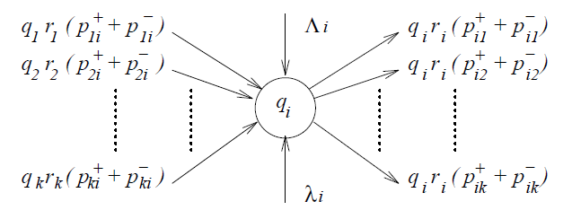
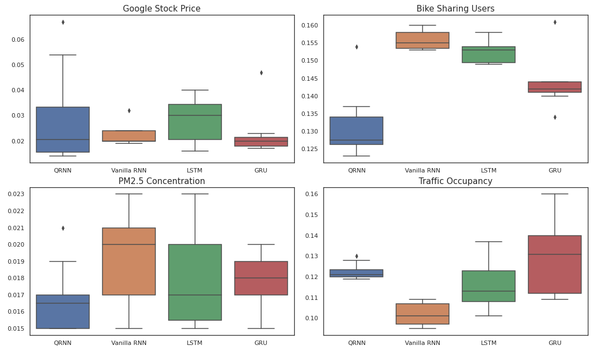

# Queueing Recurrent Neural Network (Q-RNN) [](https://www.python.org/)

**Queueing Recurrent Neural Network (Q-RNN)** is a new kind of Artificial Neural Network that has been designed to use in time-series forecasting applications. According to experiments that have been run, QRNN has a potential to outperform the LSTM, Simple RNN and GRU, in the cases where the dataset has highly non-linear characteristics.

# Table of contents

- [What is Q-RNN?](#what is q-rnn?)
- [Comparison](#comparison)
- [Installation](#installation)
- [Usage](#usage)
- [License](#license)

## What is Q-RNN?

It is a compose of Simple RNN and [Random Neural Network](https://github.com/bilkosem/random_neural_network). Queueing RNN uses the fundamental math of Queueing Theory and G-Queues while combining it with the powerful architecture of Recurrent Neural Networks. For more detailed explanation about the theoretical background of QRNN check the [mathematical-model](https://github.com/bilkosem/queueing-rnn/tree/master/mathematical-model) folder, and references section. 

## Comparison



## Installation

Installing via [pip](https://pip.pypa.io/en/stable/) package manager:

```bash
pip install queueing-rnn
```

Installing via GitHub:

```bash
git clone https://github.com/bilkosem/queueing-rnn
cd queueing-rnn
python setup.py install
```

## Usage

```python
from queueing_rnn import QRNN
```

## License

[](https://github.com/Naereen/StrapDown.js/blob/master/LICENSE)